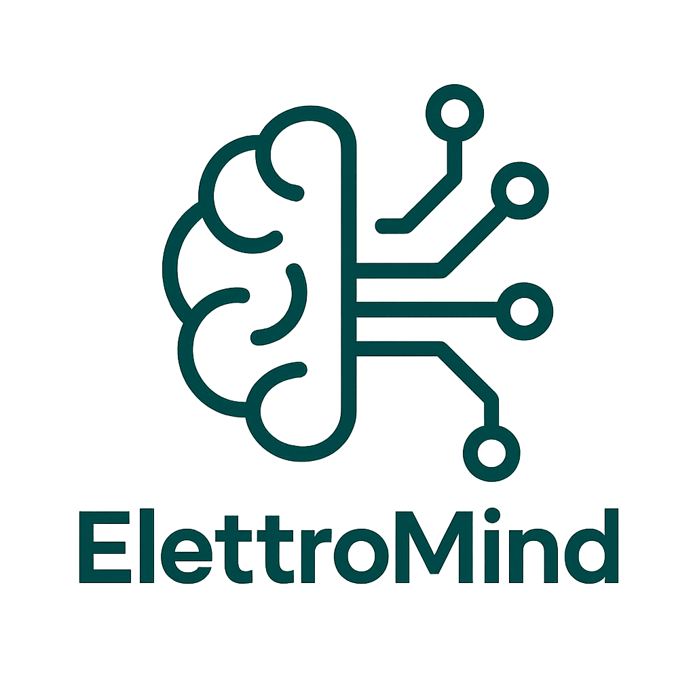

<!-- Includi CSS e JS -->
<link rel="stylesheet" href="assets/css/style.css">

{:style="width: 120px;"}

# Benvenuto su ElettroMind ⚡

**Ideato e gestito da Riccardo Trabucchi**  
Studente di Ingegneria dell'Automazione – Politecnico di Milano

---

## 🔧 Servizi offerti
- Progettazione, modellazione e **stampa 3D**
- Progettazione e **saldatura PCB**
- **Schemi elettrici** e quadri (EPLAN)
- **Impianti KNX** certificati
- Sviluppo **app Android** (MIT App Inventor)
- Programmazione **PLC** e simulazioni con **Factory IO**

---

## 🧠 Portfolio

  
Stampa 3D: supporto sensore

  
PCB sensore luce

  
App Android domotica

---

## 💻 Tecnologie usate
- Fusion 360 – Stampa 3D
- EPLAN – Schemi e quadri elettrici
- KiCAD – PCB
- MIT App Inventor – App Android
- TIA Portal, Codesys – PLC
- Factory IO – Simulazioni

---

## 🎓 Formazione
- 🏫 Istituto Salesiano – Elettrotecnica (Sesto S. Giovanni)
- 🎓 Politecnico di Milano – Ingegneria dell'Automazione

---

📫 Contattami su [LinkedIn](https://www.linkedin.com) – [Instagram](https://www.instagram.com) – [Email](mailto:riccardo@example.com)
